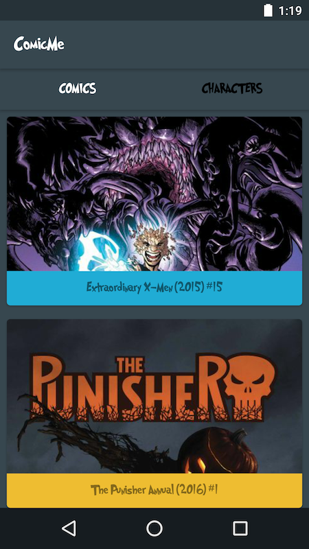

# Hathway's Android Programming Challenge

This programming challenge is meant to provide a programming challenge that is as close to possible to the real-world tasks that Android developers face each and every day. During the interview we'll ask you about software engineering principles like Big O notation, data structures, MVC, etc., but when the rubber meets the road, mobile developers need to create fluid user interfaces that often have complex controllers behind them, and this exercise attempts to test that aspect of the job.

## Instructions

You can spend as much time on the exercise as you want, but we will primarily be reviewing your commits for the first 1-2 hours after the initial commit of the Android project files.

1. Create a new public repository in GitHub or BitBucket.
2. Create a new Android project and perform an initial commit at this point.
3. As you complete the programming challenge, commit early & often with good commit messages to show your progress.
4. For **up to 2 hours** after your initial project commit, attempt to solve the challenge. At around the time limit, be sure to perform an aptly labelled "final commit". You can continue working on the challenge for as long as you'd like, but your work in the first two hours will primarily be what we will look at.
5. Send Hathway your repository URL immediately after your time has expired.

## The Challenge

Create a simple Android application that uses the [Marvel API](https://developer.marvel.com/docs) to fetch one of the main resource types (characters, comics, events, series, or stories) and renders them in a simple & straightforward way, such as the following example does:

Your result does not need to match this design exactly -- feel free to expand & improve on it as you see fit.

The furthest we expect you to go is to build the following:

1. A screen to show all the resources that were downloaded from the primary endpoint for that resource (i.e. the data from `GET /v1/public/comics`), as well as a few of the pieces of data contained in each individual response (i.e. `title`, `issueNumber`, `description`, etc.). Also make sure you display a primary image for each resource to make it look shiny.
2. A resource detail screen that shows additional interesting properties contained in the data from the API that does not fit on the list screen. Use your imagination to make it as interesting as possible!

## What We Want

Implement this feature as you would in a typical project, utilizing open-source libraries and Android platform SDK's where you find it applicable to assist you.

In general, we'll be looking at:

1. How you structure the Android application, and that you're using the SDK API's correctly
2. Code readability & simplicity
3. How much progress you make in the allotted time

Don't overthink it! Don't do things differently for this exercise than what you would in a real project -- whatever you produce in this exercise is what we'll expect if we hire you!

**Good Luck!**
